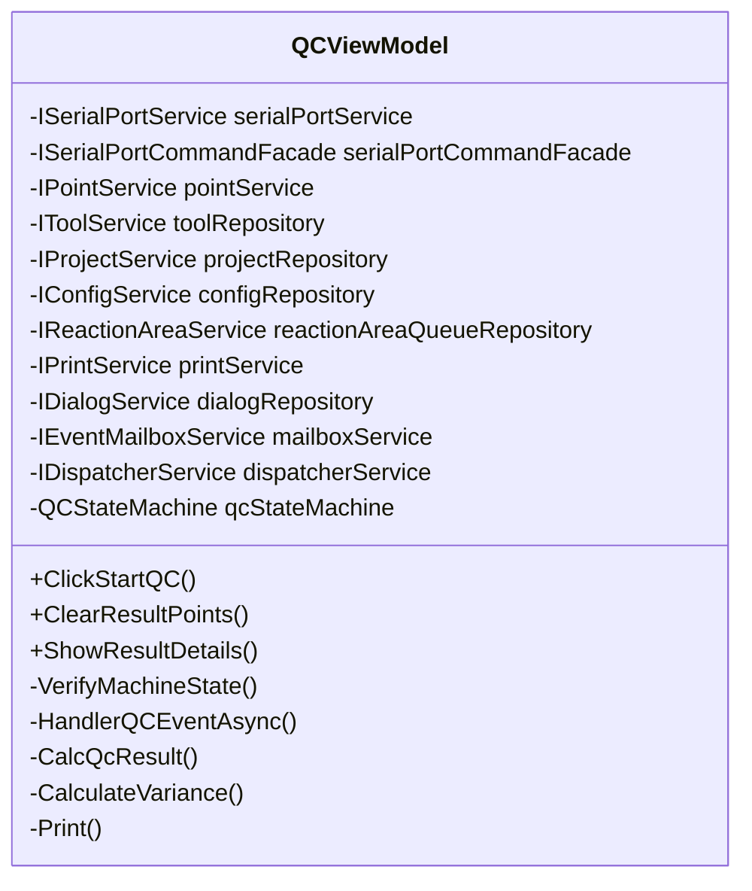
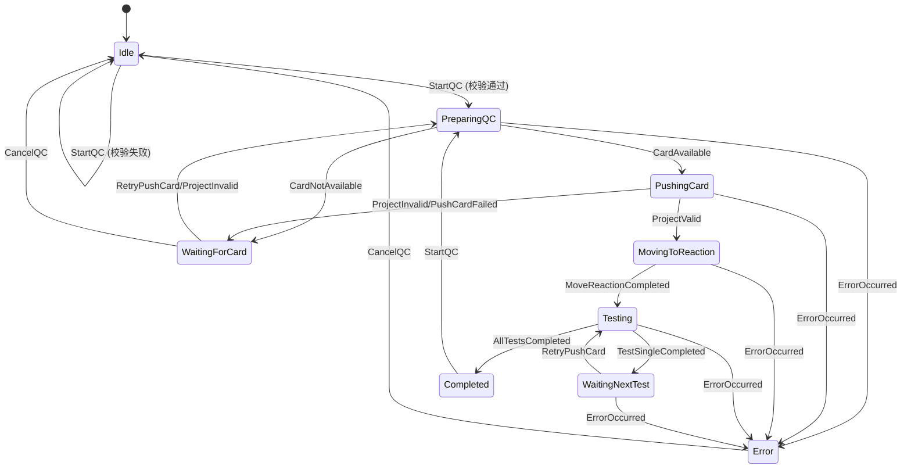
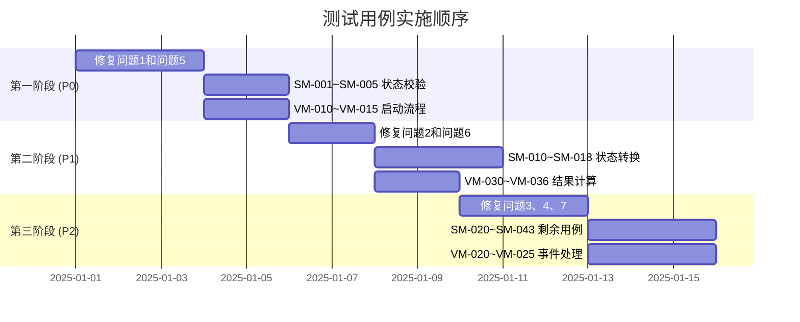

# QCModule 测试方案

## 目录
- [1. 概述](#1-概述)
- [2. 被测类分析](#2-被测类分析)
- [3. 测试性问题与修改方案](#3-测试性问题与修改方案)
- [4. 测试用例设计](#4-测试用例设计)
- [5. 测试实施建议](#5-测试实施建议)

---

## 1. 概述

本测试方案针对 QCModule（质控模块）的两个核心组件进行分析和测试设计：

| 组件 | 文件位置 | 职责 |
|------|----------|------|
| `QCViewModel` | [QCViewModel.cs](file:///j:/c#project/FluorescenceFullAutomatic/Main/ViewModels/QCViewModel.cs) | UI 层 ViewModel，处理用户交互和界面显示逻辑 |
| `QCStateMachine` | [QCStateMachine.cs](file:///j:/c#project/FluorescenceFullAutomatic/Main/StateMachine/QCStateMachine.cs) | 状态机，控制质控流程和硬件指令下发 |

现有测试文件：
- [QCViewModelTests.cs](file:///j:/c#project/FluorescenceFullAutomatic/TestMain/ViewModels/QCViewModelTests.cs) - 6 个测试用例
- [QCStateMachineTests.cs](file:///j:/c#project/FluorescenceFullAutomatic/TestMain/StateMachine/QCStateMachineTests.cs) - 1 个测试用例

---

## 2. 被测类分析

### 2.1 QCViewModel 分析

#### 类结构


#### 依赖服务（共 11 个）
| 服务接口 | 用途 |
|----------|------|
| `ISerialPortService` | 串口服务 |
| `ISerialPortCommandFacade` | 串口命令外观 |
| `IPointService` | 点位服务 |
| `IToolService` | 工具服务（计算 T/C 值）|
| `IProjectService` | 项目服务 |
| `IConfigService` | 配置服务 |
| `IReactionAreaService` | 反应区服务 |
| `IPrintService` | 打印服务 |
| `IDialogService` | 对话框服务 |
| `IEventMailboxService` | 事件邮箱服务 |
| `IDispatcherService` | 调度服务 |

#### 关键方法
| 方法 | 可见性 | 可测试性 | 说明 |
|------|--------|----------|------|
| `ClickStartQC()` | public | ? 可测试 | 开始质控的入口 |
| `ClearResultPoints()` | public | ? 可测试 | 清空结果点 |
| `VerifyMachineState()` | private | ?? 间接测试 | 验证仪器状态 |
| `HandlerQCEventAsync()` | private | ? 难以测试 | 事件处理器 |
| `CalcQcResult()` | private | ? 难以测试 | 计算质控结果 |
| `CalculateVariance()` | private | ? 难以测试 | 计算变异系数 |

---

### 2.2 QCStateMachine 分析

#### 状态流程图


#### 状态与触发器
| 状态 (QCState) | 说明 | 进入时的操作 |
|----------------|------|--------------|
| `Idle` | 空闲 | - |
| `PreparingQC` | 准备质控 | `OnEnterPreparingQCAsync` - 获取仪器状态 |
| `WaitingForCard` | 等待添加检测卡 | - |
| `PushingCard` | 推卡中 | `OnEnterPushingCardAsync` - 执行推卡 |
| `MovingToReaction` | 移动到反应区 | `OnEnterMovingToReactionAsync` - 移动指令 |
| `Testing` | 检测中 | `OnEnterTestingAsync` - 执行检测 |
| `WaitingNextTest` | 等待下一次检测 | `OnEnterWaitingNextTestAsync` - 延时等待 |
| `Completed` | 完成 | `OnEnterCompleted` - 发布完成事件 |
| `Error` | 错误 | - |

#### 触发器 (QCTrigger)
| 触发器 | 说明 |
|--------|------|
| `StartQC` | 开始质控 |
| `CardAvailable` | 检测卡可用 |
| `CardNotAvailable` | 检测卡不可用 |
| `RetryPushCard` | 重试推卡 |
| `ProjectValid` | 项目有效 |
| `ProjectInvalid` | 项目无效 |
| `PushCardFailed` | 推卡失败 |
| `MoveReactionCompleted` | 移动完成 |
| `TestSingleCompleted` | 单次检测完成 |
| `AllTestsCompleted` | 所有检测完成 |
| `CancelQC` | 取消质控 |
| `ErrorOccurred` | 发生错误 |

---

## 3. 测试性问题与修改方案

### 3.1 QCViewModel 的问题

#### 问题 1: 直接实例化 QCStateMachine

> [!CAUTION]
> **严重问题** - 影响单元测试的隔离性

**问题代码** ([QCViewModel.cs:114-115](file:///j:/c#project/FluorescenceFullAutomatic/Main/ViewModels/QCViewModel.cs#L114-L115)):
```csharp
// 创建 QC 状态机
qcStateMachine = new QCStateMachine(mailboxService, serialPortCommandFacade, projectRepository, 
    logService, toolRepository, pointService, reactionAreaService,configRepository);
```

**影响**:
- 无法在测试中 Mock `QCStateMachine`
- 测试 `QCViewModel` 时会触发真实的状态机逻辑
- 无法独立验证 ViewModel 的行为

**修改方案**:
```diff
+ // 1. 定义状态机接口
+ public interface IQCStateMachine
+ {
+     Task FireAsync(QCTrigger trigger);
+     Task HandleCardAddedConfirmAsync();
+     Task HandleRetryPushCardAsync();
+     Task HandleCancelQCAsync();
+     QCState CurrentState { get; }
+ }
+ 
+ // 2. QCStateMachine 实现接口
+ public class QCStateMachine : IQCStateMachine
+ { ... }
+ 
+ // 3. QCViewModel 通过依赖注入获取
  public partial class QCViewModel : ObservableObject
  {
-     private readonly QCStateMachine qcStateMachine;
+     private readonly IQCStateMachine qcStateMachine;
  
-     public QCViewModel(..., ILogService logService)
+     public QCViewModel(..., ILogService logService, IQCStateMachine qcStateMachine)
      {
          ...
-         qcStateMachine = new QCStateMachine(...);
+         this.qcStateMachine = qcStateMachine;
      }
  }
```

---

#### 问题 2: 私有方法 `CalculateVariance` 包含核心业务逻辑

> [!WARNING]
> **中等问题** - 影响测试覆盖率

**问题代码** ([QCViewModel.cs:259-269](file:///j:/c#project/FluorescenceFullAutomatic/Main/ViewModels/QCViewModel.cs#L259-L269)):
```csharp
private double CalculateVariance(double[] values)
{
    if (values == null || values.Length == 0)
        return 0;

    double mean = values.Average();
    double sumSquares = values.Sum(x => Math.Pow(x - mean, 2));
    double variance = Math.Sqrt(sumSquares / values.Length) / mean * 100;
    return Math.Floor(variance * 100000) / 100000;
}
```

**影响**:
- 无法直接测试变异系数计算的正确性
- 边界情况（空数组、单元素、负值）难以覆盖

**修改方案**:
```diff
+ // 1. 将计算逻辑抽取到工具类
+ public static class MathHelper
+ {
+     /// <summary>
+     /// 计算变异系数 (CV)
+     /// </summary>
+     public static double CalculateVarianceCoefficient(double[] values)
+     {
+         if (values == null || values.Length == 0)
+             return 0;
+ 
+         double mean = values.Average();
+         if (mean == 0) return 0; // 避免除零
+         
+         double sumSquares = values.Sum(x => Math.Pow(x - mean, 2));
+         double variance = Math.Sqrt(sumSquares / values.Length) / mean * 100;
+         return Math.Floor(variance * 100000) / 100000;
+     }
+ }

  // 2. QCViewModel 调用工具类
  private double CalculateVariance(double[] values)
  {
-     if (values == null || values.Length == 0)
-         return 0;
-     ...
+     return MathHelper.CalculateVarianceCoefficient(values);
  }
```

---

#### 问题 3: 私有方法 `CalcQcResult` 难以测试

> [!WARNING]
> **中等问题** - 业务逻辑不可见

**问题代码** ([QCViewModel.cs:307-353](file:///j:/c#project/FluorescenceFullAutomatic/Main/ViewModels/QCViewModel.cs#L307-L353)):
```csharp
private void CalcQcResult()
{
    QcTime = DateTime.Now.GetDateTimeString();
    // ... 计算逻辑 ...
    QcResult = isQualified ? "合格" : "不合格";
}
```

**影响**:
- 质控结果判断逻辑无法直接验证
- 依赖 `DateTime.Now`，测试结果不可预测

**修改方案**:
```diff
+ // 1. 使用时间抽象
+ public interface IDateTimeProvider
+ {
+     DateTime Now { get; }
+ }
+ 
+ public class DateTimeProvider : IDateTimeProvider
+ {
+     public DateTime Now => DateTime.Now;
+ }

+ // 2. 抽取结果判断逻辑
+ public static class QCResultCalculator
+ {
+     public const int MaxVarianceScope = 5;
+     
+     public static (double variance1, double variance2, string result) Calculate(
+         IEnumerable<Point> resultPoints, 
+         bool isDoubleProject,
+         Func<double[], double> varianceCalculator)
+     {
+         // 计算逻辑...
+     }
+ }
```

---

#### 问题 4: `ShowResultDetails` 直接访问 `MainWindow.Instance`

> [!IMPORTANT]
> **可测试性问题** - 静态单例依赖

**问题代码** ([QCViewModel.cs:381-387](file:///j:/c#project/FluorescenceFullAutomatic/Main/ViewModels/QCViewModel.cs#L381-L387)):
```csharp
resultDetailsViewModel.CloseAction = () =>
{
    MainWindow.Instance.HideMetroDialogAsync(customDialog);
};
// ...
MainWindow.Instance.ShowMetroDialogAsync(customDialog);
```

**影响**:
- 测试时没有 `MainWindow.Instance` 会导致 `NullReferenceException`
- UI 操作与业务逻辑耦合

**修改方案**:
```diff
+ // 1. 抽象对话框管理
+ public interface IDialogManager
+ {
+     Task ShowDialogAsync(CustomDialog dialog);
+     Task HideDialogAsync(CustomDialog dialog);
+ }

  // 2. QCViewModel 使用接口
  public partial class QCViewModel : ObservableObject
  {
+     private readonly IDialogManager dialogManager;
  
      public void ShowResultDetails(TestResult testResult)
      {
          // ...
          resultDetailsViewModel.CloseAction = () =>
          {
-             MainWindow.Instance.HideMetroDialogAsync(customDialog);
+             dialogManager.HideDialogAsync(customDialog);
          };
          // ...
-         MainWindow.Instance.ShowMetroDialogAsync(customDialog);
+         dialogManager.ShowDialogAsync(customDialog);
      }
  }
```

---

### 3.2 QCStateMachine 的问题

#### 问题 5: `ValidateStartQC` 依赖静态全局状态

> [!CAUTION]
> **严重问题** - 测试隔离性差

**问题代码** ([QCStateMachine.cs:318-345](file:///j:/c#project/FluorescenceFullAutomatic/Main/StateMachine/QCStateMachine.cs#L318-L345)):
```csharp
public QCValidationErrorType ValidateStartQC()
{
    if (SystemGlobal.MachineStatus == MachineStatus.None)
    {
        return QCValidationErrorType.NotSelfInspected;
    }
    // ...
    if (SystemGlobal.MachineStatus.IsRunningError())
    {
        return QCValidationErrorType.RunningError;
    }
    // ...
}
```

**影响**:
- 测试需要操作全局静态状态 `SystemGlobal.MachineStatus`
- 测试之间可能相互影响
- 无法并行运行测试

**修改方案**:
```diff
+ // 1. 定义机器状态提供者接口
+ public interface IMachineStatusProvider
+ {
+     MachineStatus CurrentStatus { get; }
+     void SetStatus(MachineStatus status);
+ }

+ // 2. 实现基于 SystemGlobal 的提供者（生产环境）
+ public class GlobalMachineStatusProvider : IMachineStatusProvider
+ {
+     public MachineStatus CurrentStatus => SystemGlobal.MachineStatus;
+     public void SetStatus(MachineStatus status) => SystemGlobal.MachineStatus = status;
+ }

  // 3. QCStateMachine 注入状态提供者
  public class QCStateMachine
  {
+     private readonly IMachineStatusProvider _machineStatusProvider;
  
      public QCStateMachine(
          IEventMailboxService mailboxService,
          // ... 其他依赖
+         IMachineStatusProvider machineStatusProvider
      )
      {
+         _machineStatusProvider = machineStatusProvider;
      }
  
      public QCValidationErrorType ValidateStartQC()
      {
-         if (SystemGlobal.MachineStatus == MachineStatus.None)
+         if (_machineStatusProvider.CurrentStatus == MachineStatus.None)
          {
              return QCValidationErrorType.NotSelfInspected;
          }
          // ...
      }
  }
```

---

#### 问题 6: 状态机方法为 `private`，难以独立测试

> [!IMPORTANT]
> **测试覆盖率问题**

**问题方法**:
- `OnEnterPreparingQCAsync()` - private
- `OnEnterPushingCardAsync()` - private
- `OnEnterMovingToReactionAsync()` - private
- `OnEnterTestingAsync()` - private
- `HandleMachineStatusReceivedAsync()` - private

**影响**:
- 只能通过触发状态转换来间接测试
- 某些边界情况难以触发

**修改方案**:
```diff
+ // 使用 InternalsVisibleTo 暴露给测试项目
+ // 在 QCStateMachine 所在项目的 AssemblyInfo.cs 中添加：
+ [assembly: InternalsVisibleTo("TestMain")]

  // 将需要测试的方法改为 internal
  public class QCStateMachine
  {
-     private async Task OnEnterPreparingQCAsync()
+     internal async Task OnEnterPreparingQCAsync()
      {
          // ...
      }
      
-     private void ProcessTestResult(BaseResponseModel<TestModel> model)
+     internal void ProcessTestResult(BaseResponseModel<TestModel> model)
      {
          // ...
      }
  }
```

---

#### 问题 7: `ProcessTestResult` 缺少输入验证

> [!WARNING]
> **代码健壮性问题**

**问题代码** ([QCStateMachine.cs:766-797](file:///j:/c#project/FluorescenceFullAutomatic/Main/StateMachine/QCStateMachine.cs#L766-L797)):
```csharp
private void ProcessTestResult(BaseResponseModel<TestModel> model)
{
    if (model.Data == null)
        return;

    // 没有验证 model.Data.Point 是否为 null
    var points = model.Data.Point.ToArray(); // 可能 NullReferenceException
    // ...
}
```

**修改方案**:
```diff
  private void ProcessTestResult(BaseResponseModel<TestModel> model)
  {
-     if (model.Data == null)
+     if (model?.Data == null)
          return;
  
+     if (model.Data.Point == null)
+     {
+         _logService.Warning("[状态机] 测试结果数据点为空");
+         return;
+     }
+ 
      var points = model.Data.Point.ToArray();
      // ...
  }
```

---

### 3.3 问题汇总表

| 序号 | 类 | 问题 | 严重程度 | 优先级 | 修改工作量 |
|------|-----|------|----------|--------|------------|
| 1 | QCViewModel | 直接实例化 QCStateMachine | ? 严重 | P0 | 中 |
| 2 | QCViewModel | 私有方法 CalculateVariance | ? 中等 | P1 | 低 |
| 3 | QCViewModel | 私有方法 CalcQcResult | ? 中等 | P1 | 中 |
| 4 | QCViewModel | 直接访问 MainWindow.Instance | ? 中等 | P2 | 中 |
| 5 | QCStateMachine | 依赖 SystemGlobal 静态状态 | ? 严重 | P0 | 中 |
| 6 | QCStateMachine | 私有方法难以测试 | ? 中等 | P1 | 低 |
| 7 | QCStateMachine | ProcessTestResult 缺少验证 | ? 低 | P2 | 低 |

---

## 4. 测试用例设计

### 4.1 QCViewModel 测试用例

#### 4.1.1 构造函数和初始化

| 测试用例ID | 测试方法名 | 测试目的 | 前置条件 | 预期结果 |
|------------|-----------|----------|----------|----------|
| VM-001 | `Constructor_ShouldInitializeResultPointsWith10Nulls` | 验证构造函数初始化 | 所有 Mock 服务 | `ResultPoints.Count == 10` |
| VM-002 | `Constructor_ShouldSubscribeToMailboxService` | 验证邮箱订阅 | - | `mailboxService.Subscribe` 被调用 |
| VM-003 | `ClearResultPoints_ShouldReset10NullPoints` | 验证清空结果点 | 已有结果数据 | `ResultPoints` 重置为 10 个 null |

#### 4.1.2 ClickStartQC 流程

| 测试用例ID | 测试方法名 | 测试目的 | 前置条件 | 预期结果 |
|------------|-----------|----------|----------|----------|
| VM-010 | `ClickStartQC_WhenMachineNotInspected_ShouldShowError` | 仪器未自检 | `MachineStatus = None` | 显示"仪器未自检"对话框 |
| VM-011 | `ClickStartQC_WhenSelfInspectionFailed_ShouldShowError` | 自检失败 | `MachineStatus = SelfInspectionFailed` | 显示"自检失败"对话框 |
| VM-012 | `ClickStartQC_WhenSampling_ShouldShowError` | 正在检测 | `MachineStatus = Sampling` | 显示"正在检测"对话框 |
| VM-013 | `ClickStartQC_WhenReactionAreaNotEmpty_ShouldShowError` | 反应区非空 | `ReactionAreaService.Count() > 0` | 显示"反应区不为空"对话框 |
| VM-014 | `ClickStartQC_WhenRunningError_ShouldShowError` | 运行错误 | `MachineStatus.IsRunningError() = true` | 显示错误对话框 |
| VM-015 | `ClickStartQC_WhenValid_ShouldPostStartQCEvent` | 状态正常 | 所有条件满足 | 发布 `StartQCEvent` |

#### 4.1.3 事件处理

| 测试用例ID | 测试方法名 | 测试目的 | 前置条件 | 预期结果 |
|------------|-----------|----------|----------|----------|
| VM-020 | `HandleEvent_QCValidationErrorEvent_ShouldShowDialog` | 验证错误事件 | 收到 `QCValidationErrorEvent` | 显示对应错误对话框 |
| VM-021 | `HandleEvent_QCNoCardAvailableEvent_ShouldShowChoiceDialog` | 无卡事件 | 收到 `QCNoCardAvailableEvent` | 显示双按钮对话框 |
| VM-022 | `HandleEvent_MachineStateChangeEvent_ShouldUpdateState` | 状态变更事件 | 收到 `MachineStateChangeEvent` | `StateMsg` 更新 |
| VM-023 | `HandleEvent_QCResultProcessedEvent_ShouldUpdateResultPoints` | 结果处理事件 | 收到 `QCResultProcessedEvent` | `ResultPoints[index]` 更新 |
| VM-024 | `HandleEvent_QCCompletedEvent_ShouldUpdateView` | 完成事件 | 收到 `QCCompletedEvent` | 界面状态更新 |
| VM-025 | `HandleEvent_QCFinishEvent_ShouldCalculateResult` | 结束事件 | 收到 `QCFinishEvent` | 计算变异系数并更新结果 |

#### 4.1.4 质控结果计算

| 测试用例ID | 测试方法名 | 测试目的 | 前置条件 | 预期结果 |
|------------|-----------|----------|----------|----------|
| VM-030 | `CalculateVariance_WithEmptyArray_ShouldReturnZero` | 空数组 | values = [] | 返回 0 |
| VM-031 | `CalculateVariance_WithSingleValue_ShouldReturnZero` | 单值 | values = [5.0] | 返回 0 |
| VM-032 | `CalculateVariance_WithIdenticalValues_ShouldReturnZero` | 相同值 | values = [5,5,5] | 返回 0 |
| VM-033 | `CalculateVariance_WithNormalValues_ShouldCalculateCorrectly` | 正常值 | values = [1,2,3,4,5] | 正确的变异系数 |
| VM-034 | `CalcQcResult_WhenVarianceWithinScope_ShouldReturnQualified` | 变异系数合格 | Variance <= 5% | `QcResult = "合格"` |
| VM-035 | `CalcQcResult_WhenVarianceExceedsScope_ShouldReturnUnqualified` | 变异系数不合格 | Variance > 5% | `QcResult = "不合格"` |
| VM-036 | `CalcQcResult_WhenDoubleProject_ShouldCalculateBothVariances` | 双联卡 | `ProjectType = Double` | 计算两个变异系数 |

---

### 4.2 QCStateMachine 测试用例

#### 4.2.1 状态校验

| 测试用例ID | 测试方法名 | 测试目的 | 前置条件 | 预期结果 |
|------------|-----------|----------|----------|----------|
| SM-001 | `ValidateStartQC_WhenMachineNotInspected_ShouldReturnError` | 未自检 | `Status = None` | 返回 `NotSelfInspected` |
| SM-002 | `ValidateStartQC_WhenSelfInspectionFailed_ShouldReturnError` | 自检失败 | `Status = SelfInspectionFailed` | 返回 `SelfInspectionFailed` |
| SM-003 | `ValidateStartQC_WhenSampling_ShouldReturnError` | 采样中 | `Status = Sampling` | 返回 `AlreadyTesting` |
| SM-004 | `ValidateStartQC_WhenReactionAreaNotFull_ShouldReturnError` | 反应区非空 | `IsFull() = false` | 返回 `ReactionAreaNotEmpty` |
| SM-005 | `ValidateStartQC_WhenAllValid_ShouldReturnNone` | 全部有效 | 所有条件满足 | 返回 `None` |

#### 4.2.2 状态转换

| 测试用例ID | 测试方法名 | 测试目的 | 前置条件 | 预期结果 |
|------------|-----------|----------|----------|----------|
| SM-010 | `FireAsync_StartQC_WhenValid_ShouldEnterPreparingQC` | 开始质控 | Idle + 校验通过 | 进入 `PreparingQC` |
| SM-011 | `FireAsync_StartQC_WhenInvalid_ShouldStayIdle` | 校验失败 | Idle + 校验失败 | 保持 `Idle` + 发布错误事件 |
| SM-012 | `FireAsync_CardAvailable_ShouldEnterPushingCard` | 卡可用 | `PreparingQC` | 进入 `PushingCard` |
| SM-013 | `FireAsync_CardNotAvailable_ShouldEnterWaitingForCard` | 卡不可用 | `PreparingQC` | 进入 `WaitingForCard` |
| SM-014 | `FireAsync_ProjectValid_ShouldEnterMovingToReaction` | 项目有效 | `PushingCard` | 进入 `MovingToReaction` |
| SM-015 | `FireAsync_MoveReactionCompleted_ShouldEnterTesting` | 移动完成 | `MovingToReaction` | 进入 `Testing` |
| SM-016 | `FireAsync_TestSingleCompleted_ShouldEnterWaitingNextTest` | 单次完成 | `Testing` + count < 10 | 进入 `WaitingNextTest` |
| SM-017 | `FireAsync_AllTestsCompleted_ShouldEnterCompleted` | 全部完成 | `Testing` + count = 10 | 进入 `Completed` |
| SM-018 | `FireAsync_CancelQC_FromAnyState_ShouldEnterIdle` | 取消质控 | 任意非 Idle 状态 | 进入 `Idle` |

#### 4.2.3 状态入口处理

| 测试用例ID | 测试方法名 | 测试目的 | 前置条件 | 预期结果 |
|------------|-----------|----------|----------|----------|
| SM-020 | `OnEnterPreparingQC_ShouldCallGetMachineState` | 获取仪器状态 | 进入 `PreparingQC` | 调用 `GetMachineStateAsync` |
| SM-021 | `OnEnterPushingCard_ShouldCallPushCard` | 推卡 | 进入 `PushingCard` | 调用 `PushCardAsync` |
| SM-022 | `OnEnterMovingToReaction_ShouldCallMoveReactionArea` | 移动反应区 | 进入 `MovingToReaction` | 调用 `MoveReactionAreaAsync` |
| SM-023 | `OnEnterTesting_ShouldCallTest` | 检测 | 进入 `Testing` | 调用 `TestAsync` |
| SM-024 | `OnEnterCompleted_ShouldPostCompletedEvent` | 完成 | 进入 `Completed` | 发布 `QCCompletedEvent` |

#### 4.2.4 结果处理

| 测试用例ID | 测试方法名 | 测试目的 | 前置条件 | 预期结果 |
|------------|-----------|----------|----------|----------|
| SM-030 | `ProcessTestResult_WhenDataNull_ShouldReturn` | 空数据 | `model.Data = null` | 无异常，提前返回 |
| SM-031 | `ProcessTestResult_WhenPointNull_ShouldNotThrow` | 空点位 | `model.Data.Point = null` | 无异常 |
| SM-032 | `ProcessTestResult_WhenValid_ShouldInsertPoint` | 有效数据 | 正常数据 | 调用 `InsertPoint` |
| SM-033 | `ProcessTestResult_WhenValid_ShouldPostResultEvent` | 有效数据 | 正常数据 | 发布 `QCResultProcessedEvent` |

#### 4.2.5 错误处理

| 测试用例ID | 测试方法名 | 测试目的 | 前置条件 | 预期结果 |
|------------|-----------|----------|----------|----------|
| SM-040 | `SafeSerialPortCall_WhenSerialException_ShouldPostError` | 串口异常 | 抛出 `SerialCommandException` | 发布 `SerialPortErrorEvent` |
| SM-041 | `SafeSerialPortCall_WhenTimeout_ShouldPostError` | 超时 | 抛出 `TimeoutException` | 发布 `SerialPortErrorEvent` |
| SM-042 | `SafeSerialPortCall_WhenDuplicate_ShouldPostError` | 命令重发 | 抛出含"串口重发"的异常 | 发布 `SerialPortErrorEvent` |
| SM-043 | `OnEnter_WhenException_ShouldFireErrorOccurred` | 状态入口异常 | 任意异常 | 触发 `ErrorOccurred` |

---

## 5. 测试实施建议

### 5.1 测试优先级



### 5.2 Mock 配置模板

```csharp
// 测试基类
public abstract class QCTestBase
{
    protected Mock<IEventMailboxService> MockMailboxService;
    protected Mock<ISerialPortCommandFacade> MockCommandFacade;
    protected Mock<IReactionAreaService> MockReactionAreaService;
    protected Mock<IProjectService> MockProjectService;
    protected Mock<IMachineStatusProvider> MockMachineStatusProvider; // 新增
    protected Mock<IQCStateMachine> MockStateMachine; // 新增
    
    [TestInitialize]
    public virtual void Setup()
    {
        MockMailboxService = new Mock<IEventMailboxService>();
        MockCommandFacade = new Mock<ISerialPortCommandFacade>();
        MockReactionAreaService = new Mock<IReactionAreaService>();
        MockProjectService = new Mock<IProjectService>();
        MockMachineStatusProvider = new Mock<IMachineStatusProvider>();
        MockStateMachine = new Mock<IQCStateMachine>();
        
        // 设置默认行为
        MockMachineStatusProvider
            .Setup(x => x.CurrentStatus)
            .Returns(MachineStatus.Standby);
            
        MockReactionAreaService
            .Setup(x => x.IsFull())
            .Returns(true);
    }
}
```

### 5.3 测试数据准备

```csharp
public static class TestDataFactory
{
    public static BaseResponseModel<TestModel> CreateValidTestResult()
    {
        return new BaseResponseModel<TestModel>
        {
            Data = new TestModel
            {
                T = "100.5",
                C = "200.3",
                T2 = "150.2",
                C2 = "250.1",
                Location = 1,
                Point = new List<double> { 1.0, 2.0, 3.0 }
            }
        };
    }
    
    public static Project CreateQCProject()
    {
        return new Project
        {
            ProjectType = Project.Project_Type_Single,
            TestType = Project.Test_Type_QC,
            ScanStart = 0,
            ScanEnd = 100,
            PeakWidth = 10,
            PeakDistance = 5
        };
    }
}
```

### 5.4 注意事项

> [!IMPORTANT]
> 1. **测试隔离**: 每个测试用例必须独立，使用 `[TestCleanup]` 重置全局状态
> 2. **并行安全**: 如果使用 `SystemGlobal` 静态状态，禁用测试并行执行
> 3. **异步测试**: 使用 `async Task` 而非 `async void`，确保异常正确传播
> 4. **Mock 验证**: 优先验证行为而非状态，使用 `Verify` 和 `Times` 断言

### 5.5 覆盖率目标

| 组件 | 目标覆盖率 | 重点覆盖区域 |
|------|------------|--------------|
| `QCViewModel` | ≥ 80% | `ClickStartQC`, `HandlerQCEventAsync`, `CalcQcResult` |
| `QCStateMachine` | ≥ 85% | `ValidateStartQC`, `ConfigureStateMachine`, 所有 `OnEnter*` 方法 |

---

## 附录: 现有测试代码审查

### 现有测试问题

| 文件 | 问题 | 建议 |
|------|------|------|
| [QCStateMachineTests.cs](file:///j:/c#project/FluorescenceFullAutomatic/TestMain/StateMachine/QCStateMachineTests.cs) | 只有 1 个测试用例，覆盖率不足 | 按 4.2 节增加测试用例 |
| [QCStateMachineTests.cs:47-48](file:///j:/c#project/FluorescenceFullAutomatic/TestMain/StateMachine/QCStateMachineTests.cs#L47-L48) | `_mockPointService` 被赋值两次，缺少 `IReactionAreaService` Mock | 修复 Mock 初始化 |
| [QCViewModelTests.cs](file:///j:/c#project/FluorescenceFullAutomatic/TestMain/ViewModels/QCViewModelTests.cs) | 使用旧的 `IReactionAreaQueueService` 接口 | 更新为 `IReactionAreaService` |
