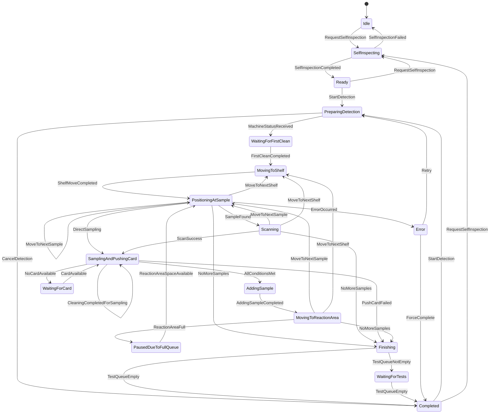
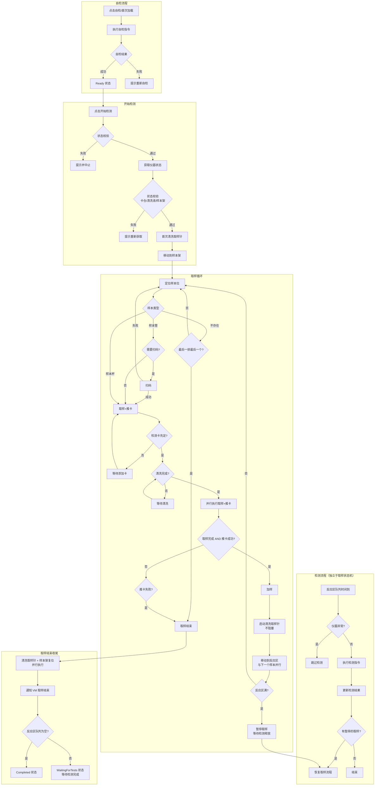
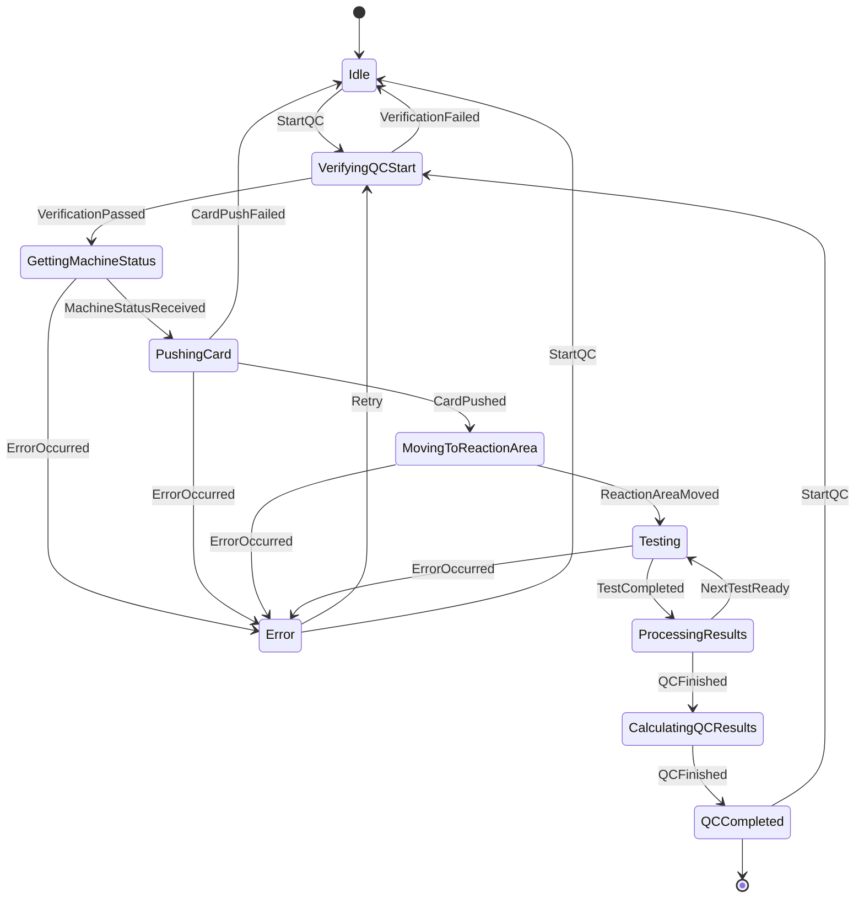
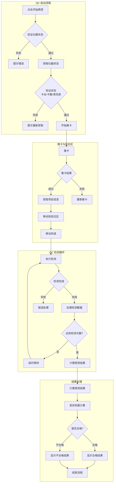

# 项目介绍
这是一个通过C#编写的自动测试项目。
1. 使用wpf + prism + mvvm架构
2. 数据库使用sqlite，用sugarorm来操作数据库。
3. 项目每个模块的功能为
    1. FluorescenceFullAutomatic.Core 模块：包含项目的Model的定义，比如状态类，枚举类等在每个模块都会用的类。
    2. Platform 模块：包含项目平台相关的代码，比如自定义的IValueConverter，自定义的通讯类，通用的工具类，通用的图片资源，数据库相关，日志相关，style,通用的viewmodel,比如提示框。
    3. HomeModule 模块：包含项目的主界面相关的代码，比如主界面的view,viewmodel,以及主界面的导航栏。
    4. UploadModule 模块：包含项目的上传界面相关的代码，比如上传界面的view,viewmodel,以及上传界面的导航栏。
4. 项目MVVM的具体实现为,已HomeViewModel为例。
    1. 每个页面（窗口和用户控件）都有一个对应的viewmodel，viewmodel负责处理页面的业务逻辑，比如数据绑定，事件处理等。
    2. HomeViewModel的构造函数通过依赖注入的方式，将HomeModule模块的需要的服务注入到HomeViewModel中。
    3. HomeViewModel中除了注入一些 日志，线程调度，工具类的Service外，还有一个IHomeService，IHomeService负责处理HomeViewModel的基本业务逻辑，所以在IHomeService中还会注入一些Service（比如数据库服务，通讯服务等）来调用Service的方法。

# 检测流程架构（状态机设计）

## 架构概述

项目采用 **状态机 + 事件邮箱** 架构：

```
┌─────────────────────────────────────────────────────────────────┐
│                     HomeViewModel                               │
│  - UI 事件转发（点击开始/自检）                                 │
│  - 接收状态机事件通知，更新 UI                                  │
│  - 检测操作调度（反应区队列时间驱动）                           │
└─────────────────────────────────┬───────────────────────────────┘
                                  │ 事件邮箱
                                  ��
┌─────────────────────────────────────────────────────────────────┐
│                 DetectionStateMachine                           │
│  - 取样流程状态机（Stateless 库）                               │
│  - 硬件指令下发与回调处理                                       │
│  - 通过事件通知 VM 更新 UI                                      │
│  - 检测操作（独立于状态流转，只检查仪器异常）                   │
└─────────────────────────────────────────────────────────────────┘
```

## 业务状态（MachineStatus）

- 等待自检：None
- 已就绪：SelfInspectionSuccess / TestingEnd
- 检测中（取样阶段）：Sampling
- 取样完成：SamplingFinished
- 检测中（仅等待反应区检测任务）：Testing
- 自检失败：SelfInspectionFailed
- 运行错误：RunningError

对应定义：FluorescenceFullAutomatic.Core\Config\MachineStatus.cs

## 状态机状态（DetectionState）

| 状态 | 说明 |
|------|------|
| Idle | 空闲状态 |
| SelfInspecting | 自检中 |
| Ready | 就绪（自检成功） |
| PreparingDetection | 准备检测（获取仪器状态） |
| WaitingForFirstClean | 等待首次清洗取样针 |
| MovingToShelf | 移动到样本架 |
| PositioningAtSample | 定位样本位 |
| Scanning | 扫码 |
| SamplingAndPushingCard | 取样+推卡并行 |
| WaitingForCard | 等待添加检测卡 |
| AddingSample | 加样 |
| MovingToReactionArea | 移动到反应区 |
| PausedDueToFullQueue | 暂停（反应区满） |
| Finishing | 取样结束收尾 |
| WaitingForTests | 等待反应区检测完成 |
| Completed | 全部完成 |
| Error | 错误状态 |

对应定义：Platform\StateMachine\DetectionState.cs

## 状态机流转图



## 业务流程图



## 核心文件说明

| 文件 | 职责 |
|------|------|
| HomeModule/StateMachine/DetectionStateMachine.cs | 取样流程状态机，硬件指令下发，检测操作 |
| Platform/StateMachine/DetectionState.cs | 状态枚举定义 |
| Platform/StateMachine/DetectionTrigger.cs | 触发器枚举定义 |
| Platform/StateMachine/StateContext.cs | 状态上下文，标志位管理 |
| Platform/Model/Events/UIEvents.cs | UI 事件定义 |
| Platform/Model/Events/HardwareEvents.cs | 硬件回调事件定义 |
| HomeModule/ViewModels/HomeViewModel.cs | UI 事件转发，状态展示 |

## 设计原则

1. **状态机集中管控**：所有取样流程逻辑由 DetectionStateMachine 统一管理
2. **事件驱动**：通过事件邮箱通信，避免轮询
3. **VM 职责单一**：ViewModel 只负责 UI 展示和事件转发
4. **检测独立**：检测操作独立于取样状态机流转，只检查仪器异常
5. **并行优化**：取样+推卡并行，清洗+后续操作并行，移动反应区+下一个样本并行

# QC 检测流程架构（状态机设计）

## 架构概述

项目采用 **状态机 + 事件邮箱** 架构进行 QC 检测流程：

```
┌─────────────────────────────────────────────────────────────────┐
│                     QCViewModel                                 │
│  - UI 事件转发（点击开始质控）                                  │
│  - 接收状态机事件通知，更新 UI                                 │
│  - 质控操作调度（反应区队列时间驱动）                          │
└─────────────────────────────────┬───────────────────────────────┘
                                  │ 事件邮箱
                                  ��
┌─────────────────────────────────────────────────────────────────┐
│                 QCStateMachine                                  │
│  - QC 检测流程状态机（Stateless 库）                           │
│  - 硬件指令下发与回调处理                                      │
│  - 通过事件通知 VM 更新 UI                                     │
│  - QC 检测操作（独立于状态流转，只检查仪器异常）              │
└─────────────────────────────────────────────────────────────────┘
```

## 业务状态（MachineStatus）

- 等待自检：None
- 已就绪：SelfInspectionSuccess / TestingEnd
- 检测中（取样阶段）：Sampling
- 取样完成：SamplingFinished
- 检测中（仅等待反应区检测任务）：Testing
- 自检失败：SelfInspectionFailed
- 运行错误：RunningError
- QC 检测：Sampling（使用 TestType 区分）

对应定义：FluorescenceFullAutomatic.Core\Config\MachineStatus.cs

## 状态机状态（QCState）

| 状态 | 说明 |
|------|------|
| Idle | 空闲状态 |
| VerifyingQCStart | 验证质控启动条件 |
| GettingMachineStatus | 获取仪器状态 |
| PushingCard | 推卡 |
| MovingToReactionArea | 移动到反应区 |
| Testing | 检测中 |
| WaitingForNextTest | 等待下次检测 |
| ProcessingResults | 处理检测结果 |
| CalculatingQCResults | 计算质控结果 |
| QCCompleted | 质控完成 |
| Error | 错误状态 |

## 状态机流转图



## 业务流程图



## 核心文件说明

| 文件 | 职责 |
|------|------|
| Main/ViewModels/QCViewModel.cs | UI 事件转发，状态展示，结果展示 |
| Main/StateMachine/QCStateMachine.cs | QC 检测流程状态机，硬件指令下发 |
| Platform/StateMachine/QCState.cs | QC 状态枚举定义 |
| Platform/StateMachine/QCTrigger.cs | QC 触发器枚举定义 |
| Platform/StateMachine/QCStateContext.cs | QC 状态上下文，标志位管理 |
| Platform/Model/Events/QCUIEvents.cs | QC 相关 UI 事件定义 |
| Platform/Model/Events/QCHardwareEvents.cs | QC 硬件回调事件定义 |

## 实现要点

1. **状态一致性**：确保状态机状态与 UI 状态保持一致
2. **错误处理**：统一的错误处理机制，支持重试
3. **数据管理**：检测结果、变异系数等数据的管理
4. **并行处理**：检测过程中的并行操作优化
5. **用户交互**：及时的 UI 反馈和状态更新
6. **流程控制**：QC 检测次数控制和结束条件判断
